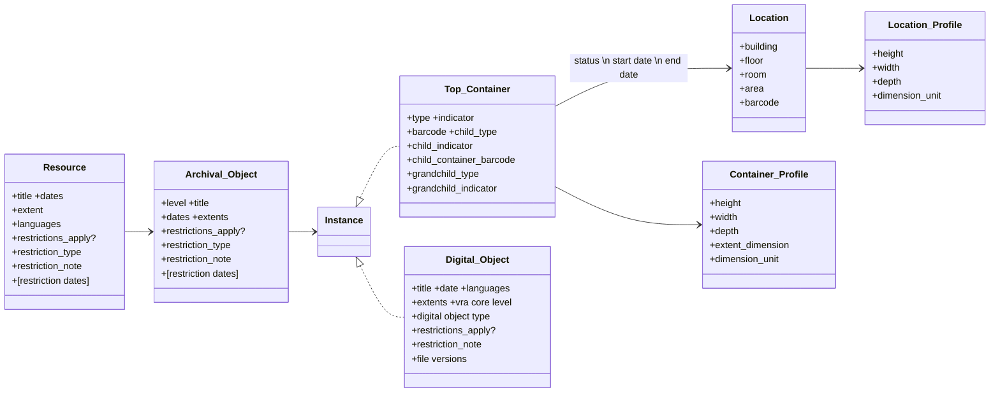

## ArchivesSpace: An Overview

[ArchivesSpace](https://archivesspace.org/) is a content management system for archival records. Its organizational home is Lyrasis.

ArchivesSpace is open-source and driven by the community. Its core code lives in [this repository](https://github.com/archivesspace/archivesspace) on github. 
The code is extensible via [plugins](https://github.com/archivesspace-plugins/) and practitioners from member institutions can submit [Jira tickets](https://archivesspace.atlassian.net/jira/software/c/projects/ANW/issues/?filter=allissues&jql=project%20%3D%20%22ANW%22%20ORDER%20BY%20created%20DESC) for bug reports or feature requests.

## The ArchivesSpace Infrastructure

ArchivesSpace consists of a mySQL database and a SOLR index. Users can interact with ArchivesSpace via the Staff User Interface (SUI), Public User Interface (PUI), or the APIs.

Technical documentation about installing and running an ArchivesSpace instance can be found [here](https://docs.archivesspace.org/), and the API documentation [here](https://archivesspace.github.io/archivesspace/api/).

## The ArchivesSpace Data Model

The database includes over 120 tables all told (including linking tables and administrative data such as user information). In terms of resource description, the main entities it defines are as follows:



## Interacting with ArchivesSpace

The SUI allows practitioners to create individual records as well as certain bulk actions, including import and export from and to spreadsheets, EAD, or MARC-XML, and bulk edits within individual Resource records.

In locally hosted environments, the data is also accessible on the backend via the mySQL database. In Princeton's case, our two ArchivesSpace instances (staging and production) are hosted by Lyrasis and we have read access to the database. By this route, we can query the data using SQL and download it in a number of formats including CSV.

Finally, the data is also accessible via APIs, and we can use those for both read and write access. We currently use Ruby for most of our ArchivesSpace-related utilities. To use Ruby with the ArchivesSpace APIs we use the [archivesspace-client](https://github.com/lyrasis/archivesspace-client) gem. (A Ruby "gem" is a library, i.e. a collection of reusable bits of code to perform specific tasks. Developers working in, say, Python would use a Python library, e.g. [ArchivesSnake](https://github.com/archivesspace-labs/ArchivesSnake), to do the same or similar things as Ruby developers do with the archivesspace-client.)

Working with the APIs allows searching, exporting, creating, deleting, or modifying records. The APIs assemble records from the mySQL tables into records reflecting the ArchivsSpace data model and return them as JSON documents by default.

For example, a resource record retrieved as a JSON document via the ArchivesSpace API might look like this:

```
{
	"lock_version": 25,
	"title": "1st Canadian Regiment, Continental Army, Payrolls and Muster Rolls",
	"publish": true,
	"restrictions": false,
	"repository_processing_note": "test ao export 5/16",
	"ead_id": "C1537",
	"ead_location": "http://arks.princeton.edu/ark:/88435/b5644v30r",
	"finding_aid_title": "1st Canadian Regiment, Continental Army, Payrolls and Muster Rolls,1776-1854(bulk1776-1780): Finding Aid",
	"finding_aid_date": "2016",
	"finding_aid_author": "Faith Charlton",
	"finding_aid_sponsor": "This collection was purchased through the Delafield Fund, which was created as a fitting memorial to General John Ross Delafield and the Delafield Family.",
	"created_by": "admin",
	"last_modified_by": "heberlei",
	"create_time": "2021-01-24T02:00:47Z",
	"system_mtime": "2024-09-18T12:56:15Z",
	"user_mtime": "2024-09-18T12:56:15Z",
	"suppressed": false,
	"is_slug_auto": false,
	"is_finding_aid_status_published": true,
	"id_0": "C1537",
	"level": "collection",
	"finding_aid_description_rules": "Finding aid content adheres to that prescribed byDescribing Archives: A Content Standard.",
	"finding_aid_language": "eng",
	"finding_aid_script": "Latn",
	"jsonmodel_type": "resource",
	"external_ids": [
		{
			"external_id": "C1537",
			"source": "collection",
			"created_by": "heberlei",
			"last_modified_by": "heberlei",
			"create_time": "2024-09-18T12:56:16Z",
			"system_mtime": "2024-09-18T12:56:16Z",
			"user_mtime": "2024-09-18T12:56:16Z",
			"jsonmodel_type": "external_id"
		}
	],
	"subjects": [
		{"ref": "/subjects/13539"},
		{"ref": "/subjects/13540"},
		{"ref": "/subjects/13541"},
		{"ref": "/subjects/13542"},
		{"ref": "/subjects/13543"},
		{"ref": "/subjects/13544"}
	],
	"linked_events": [],
	"extents": [
		{
			"lock_version": 0,
			"number": "2.0",
			"container_summary": "(1 container)",
			"physical_details": "test",
			"dimensions": "testing 2x3",
			"created_by": "heberlei",
			"last_modified_by": "heberlei",
			"create_time": "2024-09-18T12:56:16Z",
			"system_mtime": "2024-09-18T12:56:16Z",
			"user_mtime": "2024-09-18T12:56:16Z",
			"portion": "whole",
			"extent_type": "linear feet",
			"jsonmodel_type": "extent"
		}
	],
	"lang_materials": [
		{
			"lock_version": 0,
			"created_by": "heberlei",
			"last_modified_by": "heberlei",
			"create_time": "2024-09-18T12:56:16Z",
			"system_mtime": "2024-09-18T12:56:16Z",
			"user_mtime": "2024-09-18T12:56:16Z",
			"jsonmodel_type": "lang_material",
			"notes": [],
			"language_and_script": {
				"lock_version": 0,
				"created_by": "heberlei",
				"last_modified_by": "heberlei",
				"create_time": "2024-09-18T12:56:16Z",
				"system_mtime": "2024-09-18T12:56:16Z",
				"user_mtime": "2024-09-18T12:56:16Z",
				"language": "eng",
				"jsonmodel_type": "language_and_script"
			}
		}
	],
	"dates": [
		{
			"lock_version": 0,
			"expression": "1776-1780",
			"begin": "1776",
			"end": "1780",
			"created_by": "heberlei",
			"last_modified_by": "heberlei",
			"create_time": "2024-09-18T12:56:16Z",
			"system_mtime": "2024-09-18T12:56:16Z",
			"user_mtime": "2024-09-18T12:56:16Z",
			"date_type": "bulk",
			"label": "creation",
			"jsonmodel_type": "date"
		},
		{
			"lock_version": 0,
			"expression": "1776-1854",
			"begin": "1776",
			"end": "1854",
			"created_by": "heberlei",
			"last_modified_by": "heberlei",
			"create_time": "2024-09-18T12:56:16Z",
			"system_mtime": "2024-09-18T12:56:16Z",
			"user_mtime": "2024-09-18T12:56:16Z",
			"date_type": "inclusive",
			"label": "creation",
			"jsonmodel_type": "date"
		}
	],
	"external_documents": [],
	"rights_statements": [],
	"linked_agents": [
		{
			"is_primary": false,
			"role": "creator",
			"relator": "cre",
			"terms": [],
			"ref": "/agents/corporate_entities/2141"
		},
		{
			"is_primary": false,
			"role": "subject",
			"terms": [],
			"ref": "/agents/people/23260"
		}
	],
	"import_previous_arks": [],
	"revision_statements": [
		{
			"date": "2016-09-26T12:37:28.805-04:00",
			"description": "Run through PULFA 2.0 normalization routines.",
			"created_by": "heberlei",
			"last_modified_by": "heberlei",
			"create_time": "2024-09-18T12:56:16Z",
			"system_mtime": "2024-09-18T12:56:16Z",
			"user_mtime": "2024-09-18T12:56:16Z",
			"publish": true,
			"jsonmodel_type": "revision_statement",
			"uri": "/revision_statement/115408",
			"repository": {"ref": "/repositories/5"}
		},
		{
			"date": "2022-11-18 08:27:34 -0500",
			"description": "Updated physloc code",
			"created_by": "heberlei",
			"last_modified_by": "heberlei",
			"create_time": "2024-09-18T12:56:16Z",
			"system_mtime": "2024-09-18T12:56:16Z",
			"user_mtime": "2024-09-18T12:56:16Z",
			"publish": true,
			"jsonmodel_type": "revision_statement",
			"uri": "/revision_statement/115409",
			"repository": {"ref": "/repositories/5"}
		},
		{
			"date": "2023-12-05 12:36:03 -0500",
			"description": "Updated use restriction",
			"created_by": "heberlei",
			"last_modified_by": "heberlei",
			"create_time": "2024-09-18T12:56:16Z",
			"system_mtime": "2024-09-18T12:56:16Z",
			"user_mtime": "2024-09-18T12:56:16Z",
			"publish": true,
			"jsonmodel_type": "revision_statement",
			"uri": "/revision_statement/115410",
			"repository": {"ref": "/repositories/5"}
		},
		{
			"date": "2023-12-07 14:11:31 -0500",
			"description": "Benchmark test: inserted faux use restriction note.",
			"created_by": "heberlei",
			"last_modified_by": "heberlei",
			"create_time": "2024-09-18T12:56:16Z",
			"system_mtime": "2024-09-18T12:56:16Z",
			"user_mtime": "2024-09-18T12:56:16Z",
			"publish": true,
			"jsonmodel_type": "revision_statement",
			"uri": "/revision_statement/115411",
			"repository": {"ref": "/repositories/5"}
		}
	],
	"instances": [],
	"deaccessions": [],
	"related_accessions": [
		{"ref": "/repositories/5/accessions/2958"}
	],
	"classifications": [],
	"notes": [
		{
			"jsonmodel_type": "note_multipart",
			"persistent_id": "51cad91f413a0c355195a61121ec298e",
			"type": "phystech",
			"subnotes": [
				{
					"jsonmodel_type": "note_text",
					"content": "For preservation reasons, original analog\nand digital media may not be read or played back in the\nreading room. Users may visually inspect physical media\nbut may not remove it from its enclosure. All analog\naudiovisual media must be digitized to preservation-quality\nstandards prior to use. Audiovisual digitization requests\nare processed by an approved third-party vendor. Please note,\nthe transfer time required can be as little as several weeks\nto as long as several months and there may be financial costs\nassociated with the process.\nRequests should be directed through the\n<extref xlink:href='https://library.princeton.edu/special-collections/ask-us' xlink:type='simple'>Ask Us Form</extref>.",
					"publish": true
				}
			],
			"publish": true
		},
		{
			"jsonmodel_type": "note_singlepart",
			"persistent_id": "c9c097c7f2ee5fc30c386c40cc4a8e3a",
			"type": "abstract",
			"content": ["Consists of forty-three payroll sheets and fifteen muster rolls, dating from 1776 to 1780, of the 1st Canadian Regiment, which supported colonial efforts during the American Revolution. Also included is a copy of Senate Bill S. 186 submitted to the 33rd Congress by the Committee on Revolutionary Claims in 1854."],
			"publish": true
		},
		{
			"jsonmodel_type": "note_singlepart",
			"persistent_id": "8c2ce8cf9cf44385ce70da685bca68d0",
			"type": "physloc",
			"content": ["scamss"],
			"publish": true
		},
		{
			"jsonmodel_type": "note_multipart",
			"persistent_id": "dd9f378e8a6cb26f200871d420086b26",
			"type": "scopecontent",
			"subnotes": [
				{
					"jsonmodel_type": "note_text",
					"content": "Consists of forty-three payroll sheets and fifteen muster rolls, dating from 1776 to 1780, of several companies from the 1st Canadian Regiment. Payrolls contain the names and ranks of each soldier, his wage per month, his amount of subsistence, length of time for which the soldier is receiving pay, and the total amount of subsistence and wage. Some also contain information about debt owed and whether the soldier is listed as a casualty. Two payrolls from 1780 also contain soldiers' time of service. Muster rolls list personnel of the company, both officers and enlisted men, including their appointment date, duration of service, casualties, and remarks. On the verso of each is found a \"Proof of Effectives,\" or a roll call of personnel \"Present, Absent, and Total,\" with a signed oath verifying that the totals are correct. The documents also reveal the passing of several of the regiment's captains, including John Baptist Allen, Augustin Loseaux, and Timothy Hughes, as the men are identified as the \"late\" captains of their respective companies.\n\n Also included in the collection is a copy of Senate Bill S. 186 submitted to the 33rd Congress by the Committee on Revolutionary Claims in 1854.",
					"publish": true
				}
			],
			"publish": true
		},
		{
			"jsonmodel_type": "note_multipart",
			"persistent_id": "59883694a64399e0a59bbb8d9ee759b2",
			"type": "arrangement",
			"subnotes": [
				{
					"jsonmodel_type": "note_text",
					"content": "Arranged by company.",
					"publish": true
				}
			],
			"publish": true
		},
		{
			"jsonmodel_type": "note_multipart",
			"persistent_id": "48853b42182a1f75c950cdd7d4172747",
			"type": "accessrestrict",
			"rights_restriction": {
				"local_access_restriction_type": []
			},
			"subnotes": [
				{
					"jsonmodel_type": "note_text",
					"content": "Open for research.",
					"publish": true
				}
			],
			"publish": true
		},
		{
			"jsonmodel_type": "note_multipart",
			"persistent_id": "8ed743e9caab7f4f0f32f8fbf528c312",
			"type": "userestrict",
			"rights_restriction": {
				"local_access_restriction_type": []
			},
			"subnotes": [
				{
					"jsonmodel_type": "note_text",
					"content": "<p>NB: The following boilerplate text was inserted as a benchmarking test and does not constitute the actual use restriction.</p><p>Single copies may be made for research purposes. To cite or publish quotations\nthat fall within Fair Use, as defined under <extref\nxlink:href='http://copyright.princeton.edu/basics/fair-use' xlink:type='simple'>U. S. Copyright Law</extref>,\nno permission is required. The Trustees of Princeton University hold copyright to all materials generated\nby Princeton University employees in the course of their work.  For instances beyond Fair Use,\nif copyright is held by Princeton University, researchers do not need to obtain permission, complete any\nforms, or receive a letter to move forward with use of materials from the Princeton University Archives.</p>\n<p>For instances beyond Fair Use where the copyright is not held by the University, while  permission from\nthe Library is not required, it is the responsibility of the researcher to determine whether any permissions\nrelated to copyright, privacy, publicity, or any other rights are necessary for their intended use of the\nLibrary's materials, and to obtain all required permissions from any existing rights holders, if they have\nnot already done so. Princeton University Library’s Special Collections does not charge any permission or\nuse fees for the publication of images of materials from our collections, nor does it require researchers\nto obtain its permission for said use. The department does request that its collections be properly cited\nand images credited. More detailed information can be found on the <extref\nxlink:href='https://library.princeton.edu/special-collections/policies/copyright-credit-and-citation-guidelines'\nxlink:type='simple'>Copyright, Credit and Citations Guidelines</extref> page on our website. If you have any\nquestions, please feel free to contact us through the <extref\nxlink:href='https://library.princeton.edu/special-collections/ask-us' xlink:type='simple'>Ask Us! form</extref>.</p>",
					"publish": true
				}
			],
			"publish": true
		},
		{
			"jsonmodel_type": "note_multipart",
			"persistent_id": "00dc0a902afdf5e8f08edddb9cf5b549",
			"type": "acqinfo",
			"subnotes": [
				{
					"jsonmodel_type": "note_text",
					"content": "Purchase, <date type=\"acquisition\" normal=\"2016/2016\">2016</date>. (AM 2017-38)",
					"publish": true
				}
			],
			"publish": true
		},
		{
			"jsonmodel_type": "note_multipart",
			"persistent_id": "f25eb2250dea1c133119ceab6b981897",
			"type": "appraisal",
			"subnotes": [
				{
					"jsonmodel_type": "note_text",
					"content": "No materials were separated during 2016 processing.",
					"publish": true
				}
			],
			"publish": true
		},
		{
			"jsonmodel_type": "note_multipart",
			"persistent_id": "2b21b05b27d2bdfc2e8d622f8833a39b",
			"type": "relatedmaterial",
			"subnotes": [
				{
					"jsonmodel_type": "note_text",
					"content": "<extref xmlns:xlin=\"http://www.w3.org/1999/xlink\" xlink:href=\"http://arks.princeton.edu/ark:/88435/7m01bp32w\" xlin:type=\"simple\">Princeton University Library Collection of General John Ross Delafield Family Materials (C1508)</extref> \n\n  <extref xmlns:xlin=\"http://www.w3.org/1999/xlink\" xlink:href=\"http://archives.nypl.org/mss/19034\" xlin:type=\"simple\">First Canadian Regiment records, Manuscripts and Archives Division, The New York Public Library.</extref>",
					"publish": true
				}
			],
			"publish": true
		},
		{
			"jsonmodel_type": "note_multipart",
			"persistent_id": "64cac05645500f9e5ebb496e7e957c57",
			"type": "prefercite",
			"subnotes": [
				{
					"jsonmodel_type": "note_text",
					"content": "Identification of specific item; Date (if known); 1st Canadian Regiment, Continental Army, payrolls and muster rolls, Box and Folder Number; Special Collections, Princeton University Library.",
					"publish": true
				}
			],
			"publish": true
		},
		{
			"jsonmodel_type": "note_multipart",
			"persistent_id": "6cfc4921a7812d7315c742f52f58aab4",
			"type": "processinfo",
			"subnotes": [
				{
					"jsonmodel_type": "note_text",
					"content": "This collection was processed by Faith Charlton in September 2016. Finding aid written by Faith Charlton in September 2016.",
					"publish": true
				}
			],
			"publish": true
		},
		{
			"jsonmodel_type": "note_multipart",
			"persistent_id": "7d08d94c0276b625955324c8f66ae234",
			"type": "processinfo",
			"subnotes": [
				{
					"jsonmodel_type": "note_text",
					"content": "Items were repaired by Conservation during 2016 processing.",
					"publish": true
				}
			],
			"publish": true
		}
	],
	"metadata_rights_declarations": [],
	"uri": "/repositories/5/resources/3207",
	"repository": {"ref": "/repositories/5"},
	"user_defined": {
		"lock_version": 0,
		"boolean_1": true,
		"boolean_2": false,
		"boolean_3": false,
		"created_by": "heberlei",
		"last_modified_by": "heberlei",
		"create_time": "2024-09-18T12:56:16Z",
		"system_mtime": "2024-09-18T12:56:16Z",
		"user_mtime": "2024-09-18T12:56:16Z",
		"jsonmodel_type": "user_defined",
		"repository": {"ref": "/repositories/5"}
	},
	"tree": {"ref": "/repositories/5/resources/3207/tree"}
}
```
