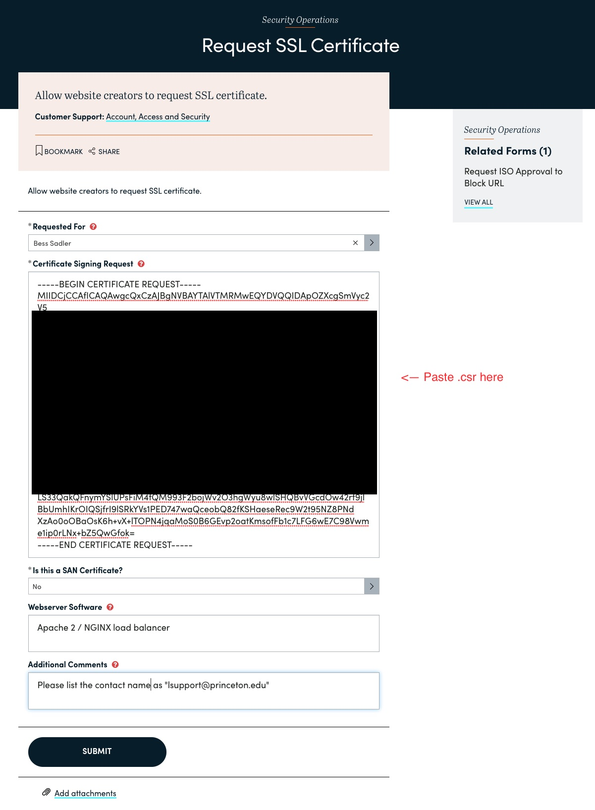

## Creating a TLS Certificate

### Overview of process

1. Create a CSR (certificate signing request) - can be automated with [playbooks/cert_renewal.yml](https://github.com/pulibrary/princeton_ansible/blob/main/playbooks/cert_renewal.yml)
2. Submit it to OIT via [this form](https://princeton.service-now.com/service?id=sc_cat_item&sys_id=cae90ab81bd1595098d1217e6e4bcb3d)
    1. Submit it to gandi via [this form](https://shop.gandi.net/en/certificate/create) when creating non-princeton.edu domains
3. Your TLS/SSL cert will be created and returned to you via a Princeton Service Portal ticket within 24 hours
    1. Your TLS/SSL cert will be created and returned to you via a email within
       3 hours from gandi.net
4. Verify the files you get back and add them to your server configuration.

### Detailed instructions

#### 1. Create the Certificate Signing Request

To generate a CSR using Ansible, run the [cert_renewal playbook](https://github.com/pulibrary/princeton_ansible/blob/main/playbooks/cert_renewal.yml).

To generate a CSR manually:

   1. For a site with no Subject Alternative Name (SAN)[1]

      * Export an environment variable with the host name for later commands
        ```
        export NEW_HOST_NAME=<new host name>
        ```
      * Create a file named `$NEW_HOST_NAME.cnf` with the following command

        ```ini
        echo "[req]
        default_bits = 2048
        distinguished_name = dn
        prompt             = no
        [dn]
        C=\"US\"
        ST=\"New Jersey\"
        L=\"Princeton\"
        O=\"The Trustees of Princeton University\"
        OU="OIT"
        emailAddress=\"lsupport@princeton.edu\"
        CN=\"$NEW_HOST_NAME.princeton.edu\"" > $NEW_HOST_NAME.cnf
        ```

      * Generate the certificate which you will provide to
        [OIT](https://princeton.service-now.com/service?id=sc_cat_item&sys_id=cae90ab81bd1595098d1217e6e4bcb3d)
        with the following command

        ```bash
        openssl req -out ${NEW_HOST_NAME}_princeton_edu.csr -newkey rsa:2048 -nodes -keyout ${NEW_HOST_NAME}_princeton_edu_priv.key -config ${NEW_HOST_NAME}.cnf
        ```

      The step :point_up_2: above will create `${NEW_HOST_NAME}_princeton_edu.csr` and
      `${NEW_HOST_NAME}_princeton_edu_priv.key` in your current directory.


   2. For a site with a Subject Alternative Name (SAN)

      * Export an environment variable with the host name for later commands
        ```
        export NEW_HOST_NAME=<new host name>
        ```

      * Create a file named `${NEW_HOSTNAME}_san.cnf` with the following command:

        ```ini
        echo "[ req ]
        default_bits       = 4096
        distinguished_name = dn
        req_extensions     = req_ext
        prompt             = no
        [ dn ]
        C=\"US\"
        ST=\"New Jersey\"
        L=\"Princeton\"
        O=\"The Trustees of Princeton University\"
        OU=\"OIT\"
        emailAddress=\"lsupport@princeton.edu\"
        CN=\"$NEW_HOST_NAME.princeton.edu\"
        [ req_ext ]
        subjectAltName = @alt_names
        [alt_names]
        DNS.1   = \"${NEW_HOST_NAME}.princeton.edu\"
        DNS.2   = \"\"" > ${NEW_HOST_NAME}_san.cnf
        ```
      * Edit the file to add your additional Alternative name

      * Generate the certificate you will provide to
        [OIT](https://princeton.service-now.com/service?id=sc_cat_item&sys_id=cae90ab81bd1595098d1217e6e4bcb3d)
        with the following command

        ```bash
        openssl req -out ${NEW_HOST_NAME}_princeton_edu.csr -newkey rsa:4096 -nodes -keyout ${NEW_HOST_NAME}_princeton_edu_priv.key -config ${NEW_HOST_NAME}_san.cnf
        ```

      The step :point_up_2: above will create `${NEW_HOST_NAME}_princeton_edu.csr` and
      `${NEW_HOST_NAME}_princeton_edu_priv.key` in your current directory.

#### 2. Submit the Certificate request to OIT

Submit the CSR via [this form](https://princeton.service-now.com/service?id=sc_cat_item&sys_id=cae90ab81bd1595098d1217e6e4bcb3d). Use the following guidance:

   * (SKIP if not SAN) Before submitting it you can check to see if your CSR contains the SAN you
     specified in the `${NEW_HOST_NAME}_san.cnf` file by doing.

      ```bash
      openssl req -noout -text -in ${NEW_HOST_NAME}_princeton_edu.csr | grep DNS
      ```

    * Provide a `cat`'ed copy of the Certificate Signing Request to
      [OIT](https://princeton.service-now.com/service?id=sc_cat_item&sys_id=cae90ab81bd1595098d1217e6e4bcb3d)
      with the following command

      ```
      cat ${NEW_HOST_NAME}_princeton_edu.csr
      ```

   * Include a note requesting that the contact name be listed as "lsupport@princeton.edu" - this ensures that the certificate expiration notice generates a SN@P ticket instead of going to just an individual.
   
   

#### 3. Check your ticket the following day

   * OIT automated process will generate tickets with Sectigo which will return in a matter of minutes

#### 4. Verify the files you get back 

   * OIT provides the certificates in the form of an email from the Certificate Manager. You will want the Certificate and Root/Intermediate files:

      * `vi ${NEW_HOST_NAME}_princeton_edu_cert.cer` and copy and paste including `-----BEGIN CERTIFICATE-----` to `-----END CERTIFICATE-----`
      * `vi ${NEW_HOST_NAME}_princeton_edu_interm.cer` and copy and paste the rest of the certificates marked as `X.509 Root/Intermediate(s)`.  This should have Multiple begin and end certificates, which should be included.

1. Create the chained file from the data returned by OIT:

   * Concatenate the certificate and the intermediate certificates to create a chained `.pem` file that includes the contents of both files:

      ```bash
      cat ${NEW_HOST_NAME}_princeton_edu_cert.cer ${NEW_HOST_NAME}_princeton_edu_interm.cer > ${NEW_HOST_NAME}_princeton_edu_chained.pem
      ```

2. Verify the certificates

    * Make sure the certificates match (the private key must be unencrypted):

    ```bash
    echo "--Certificate:" && openssl x509 -noout -modulus -in ${NEW_HOST_NAME}_princeton_edu_chained.pem && echo "--Key:" && openssl rsa -noout -modulus -in ${NEW_HOST_NAME}_princeton_edu_priv.key
    ```

    * Make sure the CN name matches ${NEW_HOST_NAME}_princeton_edu:

    ```bash
    openssl x509 -in ${NEW_HOST_NAME}_princeton_edu_chained.pem -text
    ```

3. Save the unencrypted private key for names that are not under ansible control

    * Add the unencrypted private key to Shared-SSLCerts directory of LastPass Enterprise

4. Encrypt the private key, and add the encrypted private key and the chained file to princeton-ansible:

    * Encrypt the private key with `ansible-vault` and add it to `nginxplus/files/ssl/${NEW_HOST_NAME}_princeton_edu_priv.key`

      ```
      cp ${NEW_HOST_NAME}_princeton_edu_priv.key roles/nginxplus/files/ssl/
      cd roles/nginxplus/files/ssl/
      ansible-vault encrypt ${NEW_HOST_NAME}_princeton_edu_priv.key
      ```
    * add the chained file to `nginxplus/files/ssl/`

      ```
      mv ${NEW_HOST_NAME}_princeton_edu_chained.pem roles/nginxplus/files/ssl/
      ```

[1] Subject Alternative Names are used when multiple domains share the same certificate as shown 
