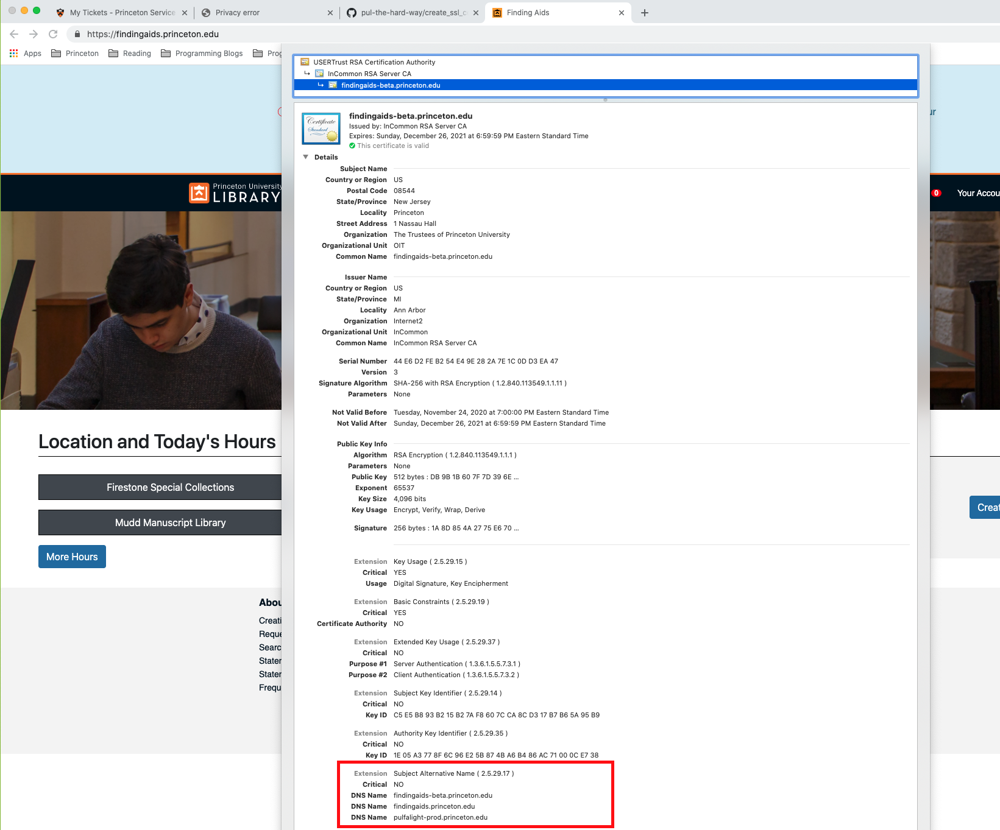

# Certificate Management

## Creating TLS Certificates

### For sites on the .princeton.edu domain
1. You can create auto-renewing certificates and keys directly on the load balancers for sites in the .princeton.edu domain. You can create a single certificate and key with [playbooks/incommon_certbot.yml](https://github.com/pulibrary/princeton_ansible/blob/main/playbooks/incommon_certbot.yml) or create a single certificate with multiple names and keys with [playbooks/incommon_certbot_multi.yml](https://github.com/pulibrary/princeton_ansible/blob/main/playbooks/incommon_certbot_multi.yml)

   1. You will need to run the above playbook on each load balancer sequentially
   1. If the certificate already exists you will need to revoke it before running your chosen playbook

### For sites outside the Princeton domain
1. Create the CSR (certificate signing request) - can be automated with [playbooks/cert_renewal.yml](https://github.com/pulibrary/princeton_ansible/blob/main/playbooks/incommon_certbot.yml)
2. Submit it to gandi via [this form](https://shop.gandi.net/en/certificate/create)
3. Your TLS/SSL cert will be created and returned to you via a email within 3 hours from gandi.net
4. Verify the files you get back and add them to your server configuration.

## Verifying certbot certificate renewals
To verify that a certificate on a server will auto-renew:

sudo certbot --standalone --non-interactive --agree-tos --email simonlee@princeton.edu --server https://acme.sectigo.com/v2/InCommonRSAOV --eab-kid  <certbot-key-eab-kid> --eab-hmac-key <certbot-key-eab-hmac-key> renew --dry-run

This command checks all certs that certbot knows about on that server.

## Viewing certificates in Sectigo
Our certificate management system is Sectigo. Operations folks can [log into Sectigo](https://cert-manager.com/customer/InCommon) using their alias email accounts and individual passwords. We can view certificate status there, but we cannot revoke or renew certificates there.

## Manually managed certs list

These certs are not managed by our usual process. These certs cover:
- sites we do not serve from the load balancers
- sites without the '.princeton.edu' extension
- vendor-hosted sites with the '.princeton.edu' extension
Many of these certs must be deployed manually. Some must also be renewed manually. If a private key is kept in princeton_ansible, it is encrypted as a file in the `/keys/` directory of the repo.

cicognara.org  
Purpose: public site for the Cicognara collection (a collaborative project)  
Managed: on gandi.net, private key is in princeton_ansible  
Deployed: on the load balancers  

dataspace.princeton.edu

dataspace-dev.princeton.edu  
Purpose: dev/staging site for dspace  
Managed: in ServiceNow, private key is on princeton_ansible  
Deployed: on Google cloud, on dev.pulcloud.io  

dataspace-staging.princeton.edu

dss2.princeton.edu  
Purpose: secures dataset downloads from a separate server for DSS via a web browser  
Managed: in ServiceNow - John will move to letsencrypt  
Deployed: on the dss2 CentOS VM  
Notes: cannot be a SAN name for the main DSS cert, because we only want to secure this functionality on one machine - can be tricky to maintain because server access requires signing nondisclosure agreements (for protected data)

ezproxy.princeton.edu  
Purpose: allows access to journals by confirming Princeton affiliation  
Managed: on ezproxy-prod1 by letsencrypt  
Deployed: in /etc/letsencrypt/live/ezproxy on the ezproxy-prod1 server  

imagecat2.princeton.edu  
Philippe will shut down the server once he has copied whatever we need from it. Once it's gone, we can revoke the cert.

lib-aeon.princeton.edu  
Purpose: redirects traffic to hosted Aeon service at https://princeton.aeon.atlas-sys.com  
Managed: for new site by the vendor  
Deployed: to new site by the vendor  
Notes: We would like to redirect the old URL on the load balancers and power off the old lib-aeon machine. The templates for printing Aeon call slips, which used to live on the lib-aeon machine, have been moved to a fileshare called aeonprint on lib-fileshare.

lib-gisportal.princeton.edu  
Purpose: for maps (Wangyal)  
Managed: in ServiceNow  
Deployed: in IIS on a physical machine that runs MS HyperV virtualization - cluster of lib-geoserv1 and lib-geoserv2 (not the Lib-Gisportal2 VM) server  
Notes: windows physical machine, you must be an admin on the Windows box, expires 2024/07/30

lib-illsql.princeton.edu  
Purpose: interlibrary loan  
Managed: in ServiceNow  
Deployed: in IIS, on the lib-illiad-new VM  
Notes: Windows VM; cert has a SAN name of lib-illiad.princeton.edu; we hope to migrate this to a hosted platform in 2024

libserv97.princeton.edu  
Purpose: Philippe's test machine, may disappear in 2024  
Managed: in ServiceNow  
Deployed: directly on the libserv97 VM (dev environment)

oar.princeton.edu

oar-dev.princeton.edu  
Purpose: open access repository  
Managed: in ServiceNow, private key is on princeton_ansible  
Deployed: on Google cloud at dev.pulcloud.io

oar-staging.princeton.edu  
Purpose: open access repository  
Managed: in ServiceNow, private key is on princeton_ansible  
Deployed: on Google cloud at staging.pulcloud.io

pulmirror.princeton.edu  
Purpose: distributing Ubuntu packages  
Managed: in ServiceNow, private key is in princeton_ansible  
Deployed: on Google cloud at pulmirror.princeton.edu

recapgfa.princeton.edu  
Purpose: ReCAP inventory management system  
Managed: by ACME directly on the VM  
Deployed: N/A - it automatically renews

simrisk.pulcloud.io  
Purpose: experimental application for CDH  
Managed: on staging.pulcloud.io by acme-client contacting letsencrypt CA  
Deployed: in /etc/ssl/simrisk.pulcloud.io.fullchain.pem on the staging.pulcloud.io server  
Maintained using `/etc/daily.local` as root

tigris.princeton.edu  
Purpose: hosted service for University Records management  
Managed: in ServiceNow, private key is in princeton_ansible  
Deployed: by vendor; to update, email a .pfx file of the cert to support@gimmal.com

### Detailed instructions for sites outside the Princeton domain

#### 1. Create the Certificate Signing Request

To generate a CSR manually:

   1. For a site with no Subject Alternative Name (SAN)[1]

      * Export an environment variable with the host name for later commands
        ```
        export NEW_HOST_NAME=<new host name>
        ```
      * Create a file named `$NEW_HOST_NAME.cnf` with the following command

        ```ini
        echo "[req]
        default_bits = 2048
        distinguished_name = dn
        prompt             = no
        [dn]
        C=\"US\"
        ST=\"New Jersey\"
        L=\"Princeton\"
        O=\"The Trustees of Princeton University\"
        OU="OIT"
        emailAddress=\"lsupport@princeton.edu\"
        CN=\"$NEW_HOST_NAME\"" > $NEW_HOST_NAME.cnf
        ```

      * Generate the certificate which you will provide to
        gandi.net with the following command

        ```bash
        openssl req -out ${NEW_HOST_NAME}.csr -newkey rsa:2048 -nodes -keyout ${NEW_HOST_NAME}_priv.key -config ${NEW_HOST_NAME}.cnf
        ```

      The step :point_up_2: above will create `${NEW_HOST_NAME}.csr` and
      `${NEW_HOST_NAME}_priv.key` in your current directory.


   2. For a site with a Subject Alternative Name (SAN)

      * Export an environment variable with the host name for later commands
        ```
        export NEW_HOST_NAME=<new host name>
        ```

      * Create a file named `${NEW_HOSTNAME}_san.cnf` with the following command:

        ```ini
        echo "[ req ]
        default_bits       = 4096
        distinguished_name = dn
        req_extensions     = req_ext
        prompt             = no
        [ dn ]
        C=\"US\"
        ST=\"New Jersey\"
        L=\"Princeton\"
        O=\"The Trustees of Princeton University\"
        OU=\"OIT\"
        emailAddress=\"lsupport@princeton.edu\"
        CN=\"$NEW_HOST_NAME\"
        [ req_ext ]
        subjectAltName = @alt_names
        [alt_names]
        DNS.1   = \"${NEW_HOST_NAME}\"
        DNS.2   = \"\"" > ${NEW_HOST_NAME}_san.cnf
        ```
      * Edit the file to add your additional Alternative name

      * Generate the certificate you will provide to gandi.net
        with the following command

        ```bash
        openssl req -out ${NEW_HOST_NAME}.csr -newkey rsa:4096 -nodes -keyout ${NEW_HOST_NAME}_priv.key -config ${NEW_HOST_NAME}_san.cnf
        ```

      The step :point_up_2: above will create `${NEW_HOST_NAME}.csr` and
      `${NEW_HOST_NAME}_priv.key` in your current directory.

#### 2. Submit the Certificate request to gandi.net

Submit the CSR to gandi.net. Use the following guidance:

   * (SKIP if not SAN) Before submitting it you can check to see if your CSR contains the SAN you
     specified in the `${NEW_HOST_NAME}_san.cnf` file by doing.

      ```bash
      openssl req -noout -text -in ${NEW_HOST_NAME}.csr | grep DNS
      ```

    * Provide a `cat`'ed copy of the Certificate Signing Request
      with the following command

      ```
      cat ${NEW_HOST_NAME}.csr
      ```

#### 4. Verify the files you get back 

   * Gandi.net provides the certificates in the form of an email. You will want the Certificate and Root/Intermediate files:

      * `vi ${NEW_HOST_NAME}_cert.cer` and copy and paste including `-----BEGIN CERTIFICATE-----` to `-----END CERTIFICATE-----`
      * `vi ${NEW_HOST_NAME}_interm.cer` and copy and paste the rest of the certificates marked as `X.509 Root/Intermediate(s)`.  This should have Multiple begin and end certificates, which should be included.

1. Create the chained file from the data returned by gandi.net:

   * Concatenate the certificate and the intermediate certificates to create a chained `.pem` file that includes the contents of both files:

      ```bash
      cat ${NEW_HOST_NAME}_cert.cer ${NEW_HOST_NAME}_interm.cer > ${NEW_HOST_NAME}_chained.pem
      ```

2. Verify the certificates

    * Make sure the certificates match (the private key must be unencrypted):

    ```bash
    echo "--Certificate:" && openssl x509 -noout -modulus -in ${NEW_HOST_NAME}_chained.pem && echo "--Key:" && openssl rsa -noout -modulus -in ${NEW_HOST_NAME}_priv.key
    ```

    * Make sure the CN name matches ${NEW_HOST_NAME}:

    ```bash
    openssl x509 -in ${NEW_HOST_NAME}_chained.pem -text
    ```

3. Save the unencrypted private key for names that are not under ansible control

    * Add the unencrypted private key to Shared-SSLCerts directory of LastPass Enterprise

4. Encrypt the private key, and add the encrypted private key and the chained file to princeton-ansible:

    * Encrypt the private key with `ansible-vault` and add it to `nginxplus/files/ssl/${NEW_HOST_NAME}_priv.key`

      ```
      cp ${NEW_HOST_NAME}_priv.key roles/nginxplus/files/ssl/
      cd roles/nginxplus/files/ssl/
      ansible-vault encrypt ${NEW_HOST_NAME}_priv.key
      ```
    * add the chained file to `nginxplus/files/ssl/`

      ```
      mv ${NEW_HOST_NAME}_chained.pem roles/nginxplus/files/ssl/
      ```

#### Tigris

In July of every year [tigris.princeton.edu](tigris.princeton.edu) will get an automatic renewal. The following steps will be needed to ensure the certificate remains renewed. 
  * Open a ticket with tigris (aka Gimmal) support at support@gimmal.com and ask who should receive the new chained file.
  * You will need the [vaulted private key](https://github.com/pulibrary/princeton_ansible/blob/main/keys/tigris_princeton_edu_priv.key) and the certificate and intermediate certificate to generate a pfx file that you will ship to the vendor

  ```bash
  cat ~/path/to/downloads/tigris_princeton_edu_cert.cer ~/path/to/downloads/tigris_princeton_edu_interm.cer > keys/tigris_princeton_edu_chained.pem
  ```

This will generate a chained file. You will be prompted for a password in the next step.

```bash
  openssl pkcs12 -export -out tigris_princeton_edu.pfx -inkey tigris_princeton_edu_priv.key -in tigris_princeton_edu_chained.pem
```

Send the resulting file to the tigris support folks via [the Secure Send Portal](https://securesend.princeton.edu/#/) along with the password used above


[1] Subject Alternative Names are used when multiple domains share the same certificate as shown 
