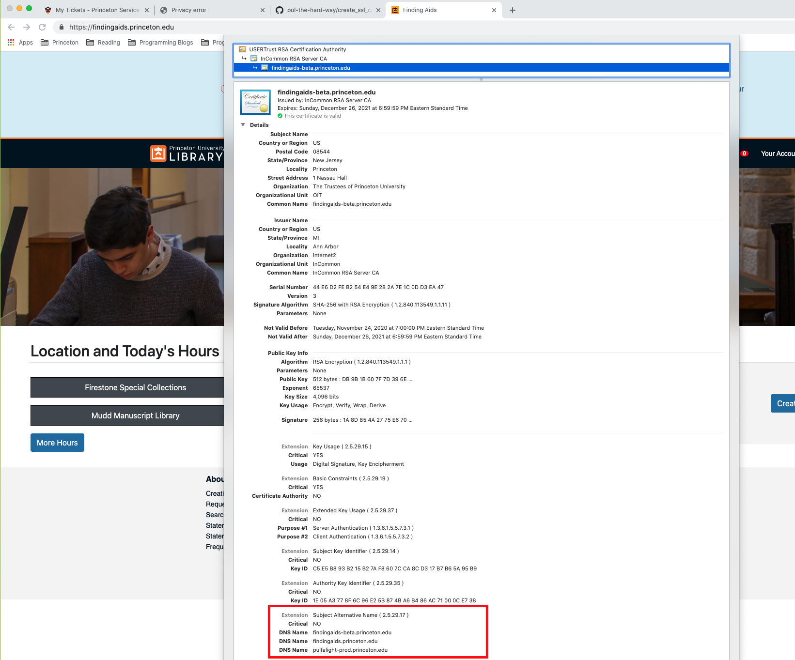

# Certificate Management

Since the switch from Sectigo to CertiNext, our certificates are no longer tracked in ServiceNow.

## Managing ACME TLS Certificates on our load balancers

Most of our sites are served from our load balancers - any site that is configured by a file in the `nginxplus` role in princeton_ansible is served from the load balancers.

### Creating certificates for sites on our load balancers with ACME

1. You can create certificates and keys directly on the load balancers for sites that are served from them. You can create a single certificate and key with [playbooks/incommon_certbot.yml](https://github.com/pulibrary/princeton_ansible/blob/main/playbooks/incommon_certbot.yml) or create a single certificate with multiple names and keys with [playbooks/incommon_certbot_multi.yml](https://github.com/pulibrary/princeton_ansible/blob/main/playbooks/incommon_certbot_multi.yml). All certificates created with these playbooks will automatically renew using ACME and certbot.

   1. You will need to run the above playbook on each load balancer sequentially
   1. If the certificate already exists you will need to revoke it before running your chosen playbook

### Revoking ACME certificates for sites on our load balancers

When we decommission a site, we need to revoke the certificates for that site.

For auto-renewing ACME certificates, use playbooks/incommon_certbot.yml](https://github.com/pulibrary/princeton_ansible/blob/main/playbooks/incommon_certbot_revoke.yml). As with the playbook that creates certificates, you must run the revoke playbook on each load balancer sequentially.

## Managing ACME TLS Certificates on other machines

A few sites run as standalone services on individual machines - some Linux and some Windows. Where possible, we also use ACME on those machines to generate and automatically renew TLS certificates for those sites.

### Managing Windows IIS certificates with ACME

Windows IIS servers should use ACME for certificate issuance and renewal so that certificates can renew automatically as certificate lifetimes become shorter. For IIS, we use CertiNext with [Win-ACME](https://www.win-acme.com/).

#### Create CertiNext ACME API credentials

1. Browse to the [CertiNext certificate management console](https://us.certinext.io/).
1. Log into CertiNext using the `Microsoft` authentication button, not SSO.
1. In the left pane, select **Integrations > APIs**.
1. In the upper right, select **Create API Credentials**.
1. Configure the integration as follows:
   * **API Type:** ACME
   * **CA Connector:** emSign
   * **Identifier:** name of the server
   * **User:** select yourself
   * **Groups:** PUL
   * **Product:** Incommon DV SSL Certificate UCC
1. Select **Generate**.
1. Open the **View** link for the new API integration and record the **Key ID**, **HMAC Key**, and **Directory URL**. These values are required when configuring Win-ACME.

#### Install Win-ACME and request the certificate

1. Log into the Windows server that needs the certificate.
1. Download the latest Win-ACME release from the [Win-ACME getting started documentation](https://www.win-acme.com/manual/getting-started).
1. Extract Win-ACME to `C:\Program Files\win-acme`.
1. Open an elevated PowerShell or Command Prompt.
1. Change to the Win-ACME directory and request the certificate. Replace `Key_ID`, `HMAC_Key`, the hostname, and friendly name with the appropriate values:

   ```powershell
   cd "C:\Program Files\win-acme"

   .\wacs.exe --source manual --host "lib-servername.princeton.edu" --friendlyname "lib-servername" --baseuri "https://acme-us.certinext.io/v1/directory" --emailaddress "lsupport@princeton.edu" --eab-key-identifier "Key_ID" --eab-key "HMAC_Key" --accepttos --installation iis --installationsiteid 1 --setuptaskscheduler --verbose
   ```

1. If the server has multiple hostnames or aliases, repeat the `wacs.exe` command for each hostname, changing `--host` and `--friendlyname` as appropriate. This creates a separate certificate for each hostname.

   At the time of this writing, we were unable to successfully create a certificate using Subject Alternative Names (SANs), so IIS hostnames are managed as separate certificates.

   We also think we failed to document a step that would go here - somehow we verified the domain ownership in CertiNext - this involved enabling the wellknown ACME challenge on IIS.

#### Complete certificate verification in IIS

1. After creating the certificate, you should receive an email to verify it.
1. Choose the option to add a TXT file to the web server root.
1. Under the IIS `wwwroot` directory, create:

   ```text
   .well-known\pki-validation
   ```

1. Create the requested text file in that directory using the filename and contents supplied by the verification process.

#### Confirm the certificate is installed

1. Open the Windows local computer certificate manager with `certlm.msc`.
1. In the left pane, expand **Web Hosting > Certificates**.
1. Confirm that the newly generated certificate appears in the certificate list.

#### Configure IIS to use the certificate

1. Open **Internet Information Services (IIS) Manager**.
1. In the left pane, expand **Sites > Default Web Site**.
1. In the right pane, select **Bindings...**.
1. Select the HTTPS binding for the hostname and select **Edit**. If the binding does not already exist, create it.
1. In **Edit Site Binding**, select the new certificate from the **SSL certificate** list.
1. If the server has more than one hostname, create or update an HTTPS binding for each hostname and select the corresponding certificate.
1. Restart IIS.
1. Browse to each hostname and confirm that IIS is serving the new certificate.

Win-ACME creates a scheduled task when `--setuptaskscheduler` is used so the certificate can renew automatically.

## Verifying certbot renewals of ACME certificates

You can verify that a certificate or certificates will automatically renew. 

### Veryifing renewals on *nix machines

On *nix operating systems, run this command (values for the eab-kid and eab-hmac-key are in group_vars/all/vault.yml for the load balancer or in the group vars for the machine that runs a standalone site - if all else fails, look in CertiNext for credentials):

`sudo certbot --standalone --non-interactive --agree-tos --email <lsupport@princeton.edu> --server <https://acme-us.certinext.io/v1/directory> --eab-kid <vault_certinext_acme_eab_kid> --eab-hmac-key <vault_certinext_acme_eab_hmac_key> renew --dry-run`

The command checks all certs that certbot knows about on that server.

### Verifying renewals on Windows machines

On Windows, look at the system scheduled tasks. A renewal check should run once per day.

## Managing certificates in CertiNext

Our certificate management system is CertiNext. Operations folks can [log into CertiNext](https://us.certinext.io/login) using the `Microsoft` login option. We can view certificate statuses, request new manual certificates, and revoke manual certificates there.

### Creating manual certificates

You can create certificates in CertiNext. To create a manual certificate, log into CertiNext, open the Certificates menu in the left navigation bar, and select Orders. The main panel opens with the Domains tab selected by default - this tab displays all certs. Select the Orders tab - this tab only displays PUL certs. Click on the New request button in the upper right and fill out the requested fields. Operations team members can approve manual certificates in CertiNext for PUL certs.

Be sure to document the purpose, management, and deployment of all manual certs on this page (see below).

#### Revoking manual Certificates

To revoke a manual certificate, log into CertiNext, open the Certificates menu in the left navigation bar, and select Orders. The main panel opens with the Domains tab selected by default - this tab displays all certs. Select the Orders tab - this tab only displays PUL certs. Use the Filter interface to narrow your search (note that the `Domain Name` column n the Filter interface corresponds to the `Identifier` column header in the data view). Once you have found the certificate you want to revoke, click on the `View` button to see details. In the "hamburger" (three dots) menu in the upper right of the details view, select `Revoke certificate` to revoke that cert.

Don't revoke ACME certs in CertiNext. It's possible, and it looks successful, but Let's Encrypt will renew the certificate within 24 hours. You must use the playbooks to revoke ACME certificates.

## Managing TLS certificates for sites that do not run on our load balancers

We have a few sites that need a different approach to certificate management. These sites include:

* sites we run on individual servers or in the cloud
* vendor-hosted sites with the '.princeton.edu' extension
* sites we serve from the load balancers with extensions other than '.princeton.edu'

Many of these certs must be deployed manually. Some must also be renewed manually.

If a private key is kept in princeton_ansible, it is encrypted as a file in the `/keys/` directory of the repo.

Here is the current list:

cicognara.org

* Purpose: public site for the Cicognara collection (a collaborative project)
* Managed: [Lego](https://github.com/pulibrary/princeton_ansible/blob/main/roles/nginxplus/tasks/lego.yml)
* Deployed: on the load balancers

dataspace.princeton.edu

* Purpose: production site for dspace
* Managed: Via [Lego](lego.md)
* Deployed: on Google cloud, on prod.pulcloud.io

dataspace-staging.princeton.edu

* Purpose: dev/staging site for dspace
* Managed: Via [Lego](lego.md)
* Deployed: on Google cloud, on dev.pulcloud.io

dss2.princeton.edu

**Expires Jan 2, 2027**

* Purpose: secures dataset downloads from a separate server for DSS via a web browser
* Managed: in ServiceNow - John will move to letsencrypt
* Deployed: on the dss2 CentOS VM
* Notes: cannot be a SAN name for the main DSS cert, because we only want to secure this functionality on one machine - can be tricky to maintain because server access requires signing nondisclosure agreements (for protected data)

ezproxy.princeton.edu

* Purpose: allows access to journals by confirming Princeton affiliation
* Managed: by ACME on ezproxy-prod1
* Deployed: in /etc/letsencrypt/live/ezproxy on the ezproxy-prod1 server

lib-aeon.princeton.edu

* Purpose: redirects traffic to hosted Aeon service at <https://princeton.aeon.atlas-sys.com>
* Managed: for new site by the vendor
* Deployed: to new site by the vendor
* Notes: We would like to redirect the old URL on the load balancers and power off the old lib-aeon machine. The templates for printing Aeon call slips, which used to live on the lib-aeon machine, have been moved to a fileshare called aeonprint on lib-fileshare.

lib-gisportal.princeton.edu

* Purpose: for maps (Wangyal)
* Managed: by ACME using Win-ACME; see [Managing Windows IIS certificates with ACME](#managing-windows-iis-certificates-with-acme)
* Deployed: in IIS on a physical machine (not the Lib-Gisportal2 VM) server
* Notes: Windows physical machine; you must be an admin on the Windows box

lib-reports.princeton.edu

* Purpose:
* Managed: by ACME on the libserv122 VM (aka lib-reports)
* Deployed: on the libserv122 VM (aka lib-reports)

lib-storage.princeton.edu

* Purpose: shared storage
* Managed: by ACME on the libserv171 VM (aka lib-storage)
* Deployed: on the libserv171 VM (aka lib-storage)

oar.princeton.edu

* Purpose: production site for oar
* Managed: Via [Lego](lego.md)
* Deployed: on Google cloud, on prod.pulcloud.io

oar-staging.princeton.edu

* Purpose: production site for oar
* Managed: Via [Lego](lego.md)
* Deployed: on Google cloud, on staging.pulcloud.io

openpublishing.princeton.edu

* Purpose: external hosted service for open access to scholarly work
* Managed: on DNSimple and Vendor's AWS Certificate Manager
* Deployed: by vendor (Notch8) and CNAME validation on DNSimple
* If ever there is a change in the application vendor will provide CNAME which can be added to DNSimple configuration
* NOTE: DNSimple currently only allows one MFA connection. If you need to log into DNSimple, ping Francis for more information.

pcdm.org

* Purpose: Portland Common Data Model
* Managed: [Lego](https://github.com/pulibrary/princeton_ansible/blob/main/roles/nginxplus/tasks/lego.yml)
* Deployed: on the load balancers

pulmirror.princeton.edu

* Purpose: distributing Ubuntu packages
* Managed: Via [Lego](lego.md)
* Deployed: on Google cloud at pulmirror.princeton.edu

recapgfa.princeton.edu

* Purpose: ReCAP inventory management system
* Managed: by ACME on the recapgfa prod VM
* Deployed: on the recapgfa production VM

scsb.recaplib.org

* Purpose: external hosted service for research collections
* Managed: on DNSimple and Vendor's AWS Certificate Manager
* Deployed: by vendor and CNAME validation on DNSimple
* If ever there is a change in the application vendor will provide CNAME which can be added to DNSimple configuration
* NOTE: DNSimple currently only allows one MFA connection. If you need to log into DNSimple, ping Francis for more information.

tigris.princeton.edu

* Purpose: hosted service for University Records management
* Managed: in ServiceNow, private key is in princeton_ansible
* Deployed: by vendor; to update, email a .pfx file of the cert to <support@gimmal.com>; see details below

#### Tigris renewals

At each renewal period, [tigris.princeton.edu](tigris.princeton.edu) will get an automatic renewal. The following steps will be needed to ensure the certificate remains renewed. Then next renewal date is in December of 2026.

* Open a ticket with tigris (aka Gimmal) support at <support@gimmal.com> and ask who should receive the new chained file.
* You will need the [vaulted private key](https://github.com/pulibrary/princeton_ansible/blob/main/keys/tigris_princeton_edu_priv.key) and the certificate and intermediate certificate to generate a pfx file that you will ship to the vendor

  ```bash
  cat ~/path/to/downloads/tigris_princeton_edu_cert.cer ~/path/to/downloads/tigris_princeton_edu_interm.cer > keys/tigris_princeton_edu_chained.pem
  ```

This will generate a chained file. You will be prompted for a password in the next step.

```bash
  openssl pkcs12 -export -out tigris_princeton_edu.pfx -inkey tigris_princeton_edu_priv.key -in tigris_princeton_edu_chained.pem
```

Send the resulting file to the tigris support folks via [the Secure Send Portal](https://securesend.princeton.edu/#/) along with the password used above

[1] Subject Alternative Names are used when multiple domains share the same certificate as shown 
