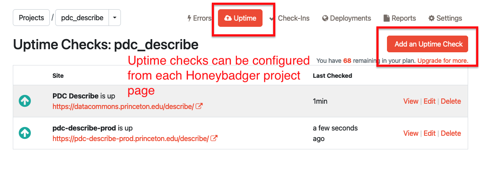
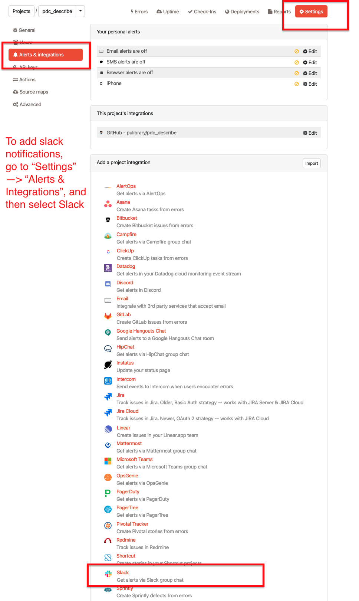
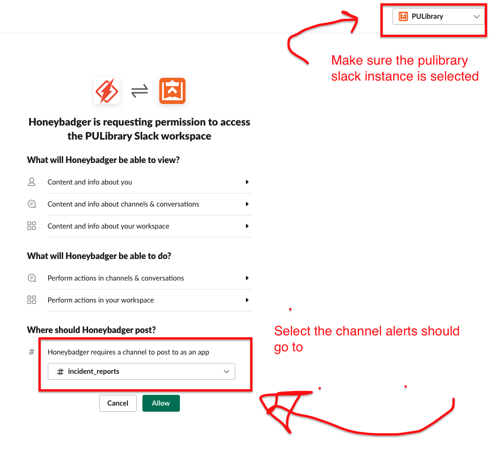
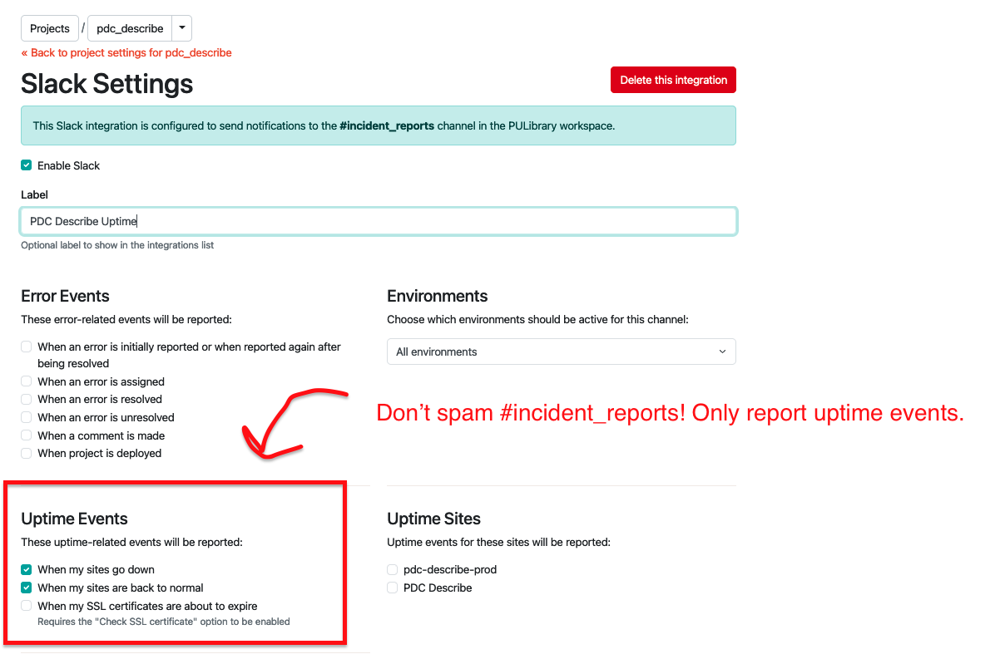

# Honeybadger
We use honeybadger.io to track production errors. We have a limited number of errors per month, so please make sure not to flood the service with errors. 

## Monitoring with Honeybadger
We also sometimes use Honeybadger for production monitoring. Note that it can only be used to monitor services that are available outside of the Princeton VPN. If you want to have honeybadger monitor your application's uptime and alert Slack if it goes down, do this:

### 1. Add an uptime check
You can add an uptime check under "Uptime" --> "Add an uptime check"

### 2. Add a slack integration

### 3. Configure the slack integration
Make sure you select `pulibrary` as the slack organization (if you're a member of more than one slack organization you might have something else show up there at first) and select the `#incident_reports` channel to send alerts to. Make sure to only send downtime alerts to `#incident_reports`, don't send lots of other errors there!

