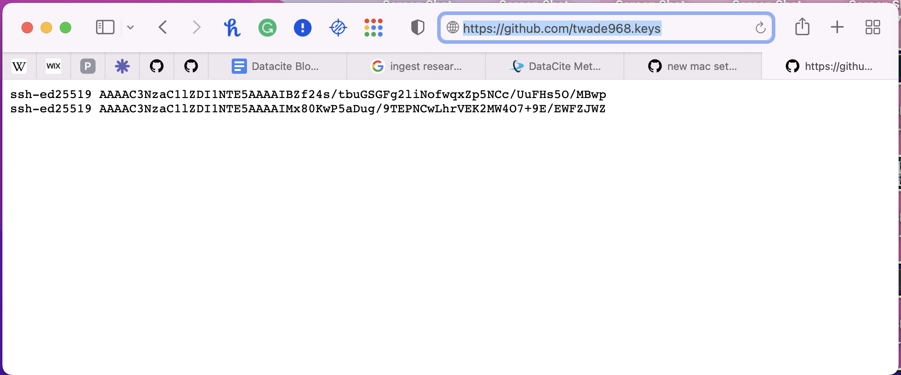
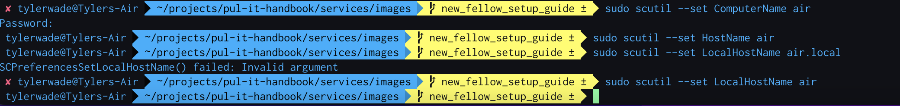
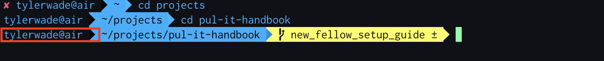

# New Mac Setup
This is a get started guide to make it easier to setup your mac.

When you get a new mac here are some helpful guides to setting it up for PUL software development.

1. Customize and setup your unix prompt.
    1. Install Xcode CLI tools: `xcode-select —-install`
    2. [Install homebrew](https://brew.sh/)
    3. Many of us prefer using iTerm2 over the default terminal.  You can install it with `brew install iterm2 --cask`
    4. We use zsh as a unix prompt. This is the default for newer Macs, but if it is not installed, you can install it with `brew install zsh`.
    5. Many of us use Oh My Zsh.  You can install it with `sh -c "$(curl -fsSL https://raw.githubusercontent.com/ohmyzsh/ohmyzsh/master/tools/install.sh)"`

2. A new SSH key will also need to be installed on your mac. Below is the link with the steps for connecting to github using SSH keys. The SSH key will be needed to connect with your github account and grants you the ability to start adding data into PUL repositories. To check and see if this step was completed correctly you will need to go to the github webpage that shows your public keys. listed below the SSH key documetation is an example of the github URL used to check your public keys. Make sure that your github profile name is included and followed by .keys (github.com/your_github_id.keys)

https://docs.github.com/en/authentication/connecting-to-github-with-ssh

https://github.com/twade968.keys




3. New fellows may also want to rename the computer name,hostname and local hostname on your Mac machine. Below is the link to help rename.

https://jumpcloud.com/blog/how-to-rename-computer-name-hostname-local-hostname-macos

Before I changed my hostname this is what my unix prompt looked like


This is what the unix prompt should look like after change



4. New fellows will need to download and install microsoft visual studio (VS Code) for mac os. You will also need to install the commands that allow you to launch VS Code from the iterm2 terminal command line. Link to instructions are below.

https://code.visualstudio.com/docs/setup/mac


5. install these programs with homebrew
```
brew install bat
brew install gpg 
brew install postgres
brew install --cask lando
brew install asdf
```


6. After installing asdf you will need a few other asdf plugins to work with PUL projects. Common plugins needed are below.

* https://asdf-vm.com/guide/getting-started.html
* https://github.com/asdf-vm/asdf-nodejs
* https://github.com/asdf-vm/asdf-ruby
* https://github.com/twuni/asdf-yarn
* https://gist.github.com/johnny-aroza/ab1ef0db48118f156bf39ed25b509544


7. You will also need to install git config commands. The git config command is a convenience function that is used to set Git configuration values on a global or local project level. You can use the Git configuration file to customize how Git works.
```
git config --global user.name "Your Name"
git config --global user.email "your_princeton_email"
git config --global core.pager bat
```

Trouble shooting: 
1. 
