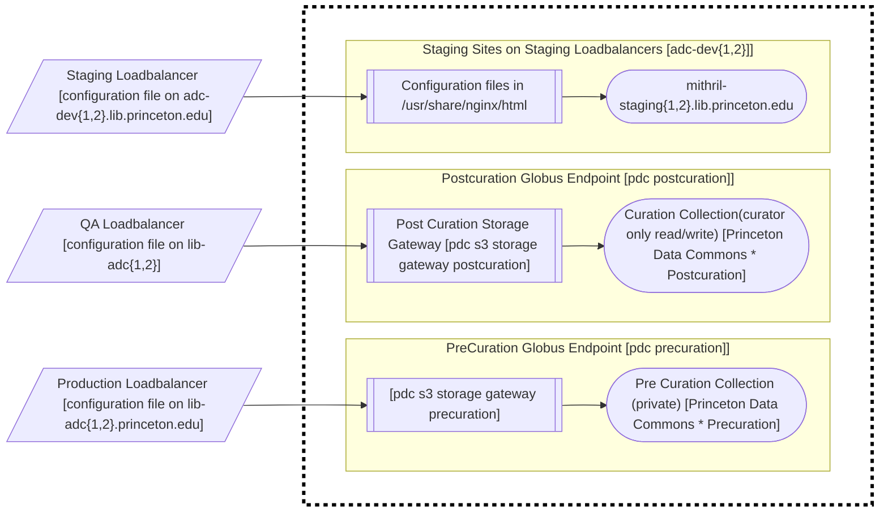

# Private Network Migration

Library IT is migrating VMs to new IPs to take advantage of our private network. Our Application Delivery Controllers (loadbalancers) are multi-homed on both the private and public networks, so they can connect to servers on the private network. In tandem with this IP migration, we are also moving FQDNs for VMs to the `.lib` domain and moving staging sites to our staging load balancers.

By migrating our VMs to IPs on the private network, we improve our security posture, expand our network throughput (because the private network has 10GB capacity, compared to 1GB on the public network), and release scarce publicly routable IPs back to the University.

By migrating VM FQDNs to the .lib domain, we can easily see which VMs have publicly routable IPs and which do not.

By migrating staging sites to the staging load balancers, we free up capacity on the production load balancers and reduce risk to production sites from experimentation on staging sites.

## Don't Panic

This guide describes the migration of a fictional brownfield staging application. When it's done, the application servers will be on our [private network (RFC 1918)](https://www.rfc-editor.org/rfc/rfc1918), the VMs will be on our `.lib` domain, and the site will be on our staging load balancers.

### Fictional site before the Migration

The fictional site is called `mithril-staging.princeton.edu`. It's a fairly typcial staging site. Before the migration begins, the site has:
  * An alias configured on our production loadbalancers as mithril-staging.princeton.edu
  * Two VMs called `mithril-staging1.princeton.edu` and `mithril-staging2.princeton.edu` 
  * An nginxplus upstream configuration file in `roles/nginxplus/files/conf/http/mithril-staging.conf`
  * Pointers in that configuration file to the two VMs:
    ```conf
    upstream mithril-staging {
    zone mithril-staging 128k;
    least_conn;
    server mithril-staging1.princeton.edu resolve;
    server mithril-staging2.princeton.edu resolve;
    ```

### Migrating IPs to the private network

To migrate a VM's IP address from a publicly routable IP (usually 128.112.x) to an IP on our private network (usually 172.20.x), the Operations team can use the [Network Record - Modify form](https://princeton.service-now.com/service?id=sc_cat_item&sys_id=b28546e14f09ab4818ddd48e5210c756) to request a new IP address for each VM.
1. Select the Device - for example, `mithril-staging1.princeton.edu`.
2. Under 'What would you like to modify?' select `Wired static IP`.
3. Select the Host (there will only be one) and check 'Add/Modify/Delete MAC Address or Static IP'.
4. Under 'IPv4 requiring network change' select the IP/MAC address (there will only be one).
5. Under 'New Network' select `ip4-library-servers`.
6. Click Submit. This creates a ticket in ServiceNow, and you should receive the usual ServiceNow updates. Note both the old and the new IP addresses.
7. In vSphere, edit the VM's settings and switch the 'Network Adapter' to `VM Network - LibNet`.
8. Reboot the VM so it picks up the new IP address.
9. Delete all firewall rules related to the old IP address, since the IP will likely be re-used for another system or service.

### Migrating VM FQDNs to the .lib domain

We use two kinds of FQDNs in common library tasks: sites and VMs. For example, `mithril-staging.princeton.edu` is a site FQDN; `mithril-staging1.princeton.edu` is a VM FQDN. We can (and probably will) leave all site FQDNs as they are. We do not need to  add `.lib` to site FQDNs - though we can if folks want to!

NOTE: Migrating existing VMs does involve some downtime. If you want to avoid downtime, create new VMs instead. If you create new VMs, start the checklist below at number 7.

* Either change the DNS record for the FQDN of each existing VM, or create new VMs in the `.lib` domain. If you create new VMs, be sure to give them the `.lib.princeton.edu` extension in DNS, set the 'Network Adapter' in vSphere to to `VM Network - LibNet`, and select the `ip4-library-servers` network when registering them with OIT. 

To transfer `mithril-staging1.princeton.edu` to `mithril-staging1.lib.princeton.edu`, the Operations team can use the [Network Record - Modify form](https://princeton.service-now.com/service?id=sc_cat_item&sys_id=b28546e14f09ab4818ddd48e5210c756) to request a new IP address for each VM.
1. Select the Device - for example, `mithril-staging1.princeton.edu`.
2. Under 'What would you like to modify?' select `Wired static IP`.
3. Select the Host (there will only be one) and check 'Modify Device Name'.
4. Under 'Device record' set 'DNS Domain Zone' to `lib.princeton.edu` and set 'Device Name' to `mithril-staging1` - the combination of these two settings will get you `mithril-staging1.lib.princeton.edu`. 
6. Click Submit. This creates a ticket in ServiceNow, and you should receive the usual ServiceNow updates.
7. Update the server definitions in your project's 'config/deploy/staging.rb' file, adding the `.lib` to each entry:
  ```conf
  server "mithril-staging1.lib.princeton.edu", user: "deploy", roles: %w[app db web]
  server "mithril-staging2.lib.princeton.edu", user: "deploy", roles: %w[app db web]
  ```
8. If you created new VMs, run the application build playbook and do anything else you need to do (for example, cap deploy to deploy code, etc.) to set them up.
9. Update the nginxplus config to point to the VMs in the .lib domain (transferred or new):
  ```conf
  upstream mithril-staging {
    zone mithril-staging 128k;
    least_conn;
    server mithril-staging1.lib.princeton.edu resolve;
    server mithril-staging2.lib.princeton.edu resolve;
  ```
10. Run the nginxplus playbook to deploy the config changes.
11. Open a PR to update the princeton_ansible inventory for all migrated VMs.
12. If you created new VMs, decommission the old VMs with all firewall rules, etc.

### Migrating staging sites to the staging load balancers

To migrate a staging site to the new staging load balancers, the Operations team can modify the network registration to transfer the site FQDN `mithril-staging.princeton.edu` from the production loadbalancers to the dev loadbalancers
1. Use the [network record - modify form](https://networkregistration.princeton.edu).
2. Select lib-adc.princeton.edu for the Device.
3. Select Wired static IP records for 'What would you like to modify'.
4. Select the Host and check 'Add/Modify/Delete alias'.
5. Scroll down to find the 'Transfer Aliases' section, and enter the site under 'Aliases to transfer to another Host' and select `adc-dev.lib.princeton.edu` under 'Transfer Aliases to'.
6. Click Submit.
7. Create SSL certificates on the dev loadbalancers by running the [Incommon Certificates](playbooks/incommon_certbot.yml) on the dev loadbalancers:
  * Run `ansible-playbook -v -e domain_name=mithril-staging --limit adc-dev2.lib.princeton.edu playbooks/incommon_certbot.yml`.
  * Repeat on adc-dev1.lib.princeton.edu.
8. Update the cache definition in the site's nginxplus config to point to `/var/cache/nginx/<site-name>/` (on the prod LBs the caches are in `/data/nginx/<site-name>/NGINX_cache`).
9. Move the site's nginxplus config file from `roles/nginxplus/files/conf/http/mithril-staging.conf` to `roles/nginxplus/files/conf/http/dev/mithril-staging.conf`.
10. Run the nginxplus playbook on all four loadbalancers (one at a time), to remove the config from production and add it to staging.
11. Revoke the old SSL certificates on the production loadbalancers.

## WIP graph of Princeton loadbalancer setup

Our private network setup consists of the following possible configurations.


