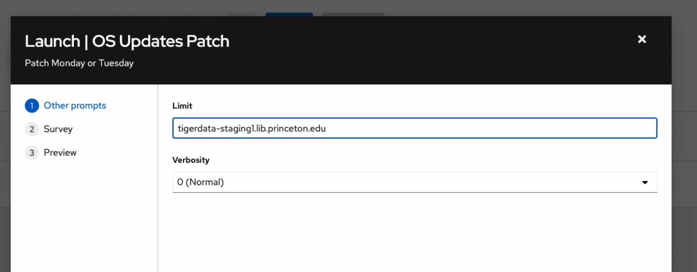

# How to replace and rebuild a VM

## Replace the VM

If you haven't already, be sure to follow the steps for cloning the princeton_ansible repo and "first-time setup" instructions if the repo does not already exist on your machine

* Go to ansible tower
* Search for a template called "replace a VM (Originally in staging)"
* Select "launch" 
* For `source control branch` we leave the value as `main`
* Enter the host name in the "VM to replace" field of the main branch w/out .lib.princeton.edu (ex. orcid-staging2)
* Use `2026-jammy-0213-template` as of January 2026
    * This will replace the VM with a new one that has the same name
* You will need to enter the suffix of the vm of either .lib.princeton.edu or princeton.edu on the "which domain is this on" field
* Click next then Launch the Playbook

## Update the ssh keys

* If we have new developers a PR to that repo and re-running the just build command will add the new dev to the image.
* Enter the fully qualified domain name
* This will add the pulsys ssh keys

## Run the check mk playbook

This command can be run on your terminal or in [ansible-tower](https://ansible-tower.princeton.edu/#/templates/job_template/68/details):

* Search for "Utils: Install CheckMK Agent on a VM" template in Ansible tower
* Select launch
* In the `limit` field enter machine FQDN `example: orcid-staging1.princeton.edu`
* In the Verbosity field, select your desired verbosity for your playbook run.
* In the `which inventory group` select your inventory group [staging, qa, prod]
* In the `checkmk services that should monitor these hosts` select from [staging, production, aws, gcp]
* In the folder for which CheckMK should go into select the relevant folder `ex. linux/rdss`
* Then launch

Or by running the command in princeton_ansible:

    `ansible-playbook playbooks/utils/checkmk_agent.yml --limit=tigerdata_staging -e checkmk_folder=linux/rdss -e checkmk_service=staging`

Confirm by checking that CheckMK was installed and configured by going to [CheckMK URL](https://pulmonitor.princeton.edu/staging/check_mk/login.py?_origtarget=index.py%3Fstart_url%3D%252Fstaging%252Fcheck_mk%252Fview.py%253Fhost%253Dorcid-staging1%2526site%253Dstaging%2526view_name%253Dhost)

* Go to "Monitor" then "All host" and locate your newly built VM name

If it still fails, confirm if the firewall is blocking it with `sudo ufw status`. The output of this command will look like this below:

            `Last login: Thu Nov 20 16:39:04 2025 from 172.20.198.30
            pulsys@tigerdata-staging1:~$ sudo ufw status
            Status: active

            To                Action         From
            --                ------          ----
            22/tcp             ALLOW       10.249.64.0/18
            22/tcp             ALLOW       10.249.0.0/18
            22/tcp             ALLOW       128.112.0.0/16
            2/tcp              ALLOW       172.20.80.0/22
            22/tcp             ALLOW       172.20.95.0/24
            22/tcp             ALLOW       172.20.192.0/19
            22/tcp             ALLOW       10.0.2.0/24
            52311/tcp          ALLOW       Anywhere
            52311/tcp (v6)     ALLOW       Anywhere (v6)`

You can disable the firewall with `sudo ufw disable` while connected to the VM. New VMs are now built to have the firewall enabled by default: https://github.com/pulibrary/vm-builds/blob/main/ansible/roles/security_firstboot/tasks/firewall_ubuntu.yml

## Run your playbook
* On ansible tower search for your application under templates ex. "RDSS - Orcid Playbook" then launch your playbook 

## Run the patches

ssh into the machine and run the following commands
* sudo apt -y update
* sudo apt -y upgrade
* sudo /sbin/reboot

Or run it on ansible-tower:

## Fix the known hosts

You will have to ssh to tower-deploy to .ssh and remove the host key
ssh deploy@towerdeploy1.princeton.edu

## Cap Deploy

Run the "1 Cap Deploy" playbook in ansible-tower for your new VM

### Try deploying

Now tower should be able to do a deploy